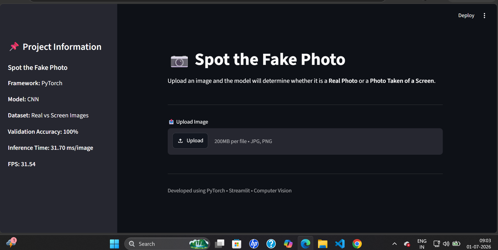
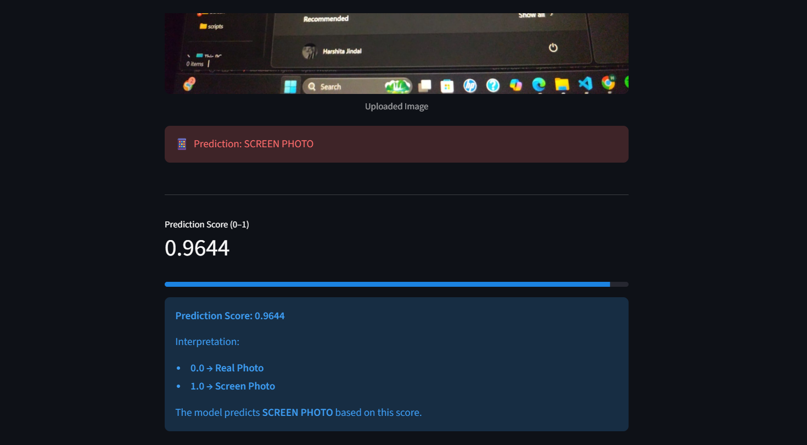
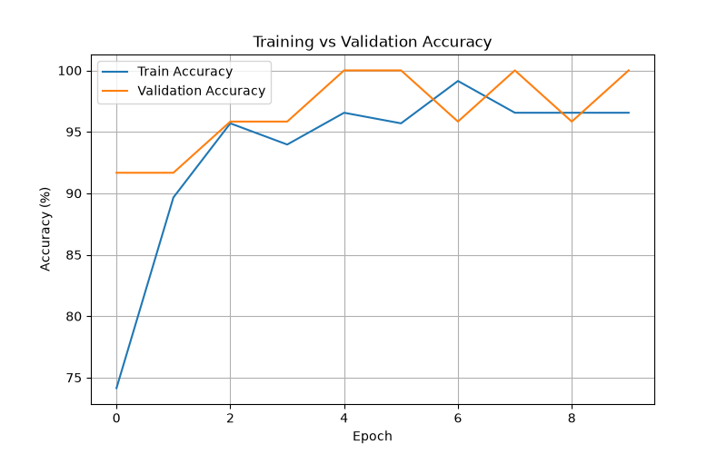
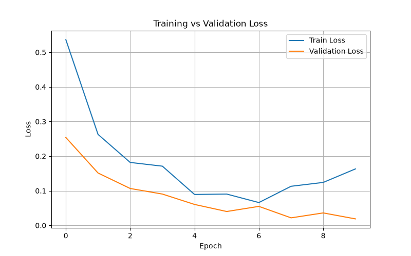
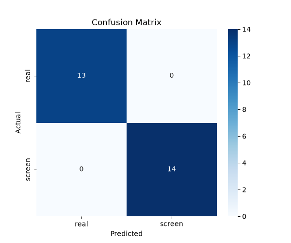

# 📷 Spot-The-Fake-Photo

A Deep Learning project that detects whether an uploaded image is a **Real Photograph** or a **Photo Taken of a Digital Screen** using **PyTorch** and **Computer Vision**.

---

## 📖 Project Overview

With the increasing use of screenshots and photos of screens, distinguishing them from genuine photographs has become important for applications such as document verification, fraud detection, and digital forensics.

This project trains a Convolutional Neural Network (CNN) to classify an image into one of two categories:

- 📸 Real Photo
- 📱 Screen Photo

The project also includes a Streamlit web application for real-time image prediction.

---

## ✨ Features

- Custom image dataset
- Data augmentation
- CNN-based image classification
- Model evaluation using confusion matrix and classification report
- Benchmarking (Latency & FPS)
- Command-line prediction
- Interactive Streamlit web application
- Clean project structure

---

## 🗂️ Project Structure

```
Spot-The-Fake-Photo/
│
├── dataset/
│   ├── train/
│   ├── val/
│   └── test/
│
├── demo/
│
├── docs/
│
├── models/
│   └── best_model.pth
│
├── notebooks/
│   └── EDA.ipynb
│
├── results/
│
├── scripts/
│
├── src/
│
├── app.py
├── predict.py
├── requirements.txt
└── README.md
```

---

## 🛠️ Technologies Used

- Python
- PyTorch
- Torchvision
- Streamlit
- NumPy
- Matplotlib
- Scikit-learn
- Pillow
- tqdm

---

## 📂 Dataset

The dataset contains two classes:

| Class | Description |
|--------|-------------|
| Real | Images captured directly using a camera |
| Screen | Photos taken of screens displaying images |

Dataset Split:

- Training: 70%
- Validation: 15%
- Testing: 15%

---

## 📊 Exploratory Data Analysis

EDA performed includes:

- Class distribution
- Image resolution analysis
- Image visualization
- Corrupted image check
- Sample image grid

Notebook:

```
notebooks/EDA.ipynb
```

---

## 🧠 Model Architecture

The model consists of:

- Convolution Layers
- ReLU Activation
- Max Pooling
- Fully Connected Layers
- Softmax Output

Loss Function:

```
CrossEntropyLoss
```

Optimizer:

```
Adam
```

Learning Rate:

```
0.0001
```

Epochs:

```
10
```

---

## 📈 Training Results

| Metric | Value |
|--------|--------|
| Training Accuracy | 99.14% |
| Validation Accuracy | 100% |
| Best Model Saved | ✅ |

---

## 📉 Evaluation

The trained model achieved:

- Precision: 1.00
- Recall: 1.00
- F1 Score: 1.00
- Test Accuracy: 100%

Confusion Matrix:

*(Add screenshot here after saving it in docs folder)*

```
docs/confusion_matrix.png
```

---

## ⚡ Benchmark

Average inference time:

```
31.70 ms/image
```

Frames Per Second (FPS):

```
31.54
```

---

## 🖥️ Streamlit Demo

Run:

```bash
streamlit run app.py
```

Features:

- Upload Image
- Predict Real/Screen
- Confidence Score
- User-Friendly Interface

---

## 🚀 Installation

Clone the repository:

```bash
git clone https://github.com/HarshitaJindal09/Spot-The-Fake-Photo.git
```

Move into the project:

```bash
cd Spot-The-Fake-Photo
```

Install dependencies:

```bash
pip install -r requirements.txt
```

---

## ▶️ Usage

Train the model:

```bash
python -m scripts.train
```

Evaluate:

```bash
python -m scripts.evaluate
```

Benchmark:

```bash
python -m scripts.benchmark
```

Predict:

```bash
python predict.py demo/real1.jpeg
```

Run Web App:

```bash
streamlit run app.py
```

---

## 📷 Screenshots

### Streamlit Home



---

### Real Photo Prediction


---

### Screen Photo Prediction



---

### Training Accuracy



---

### Training Loss



---

### Confusion Matrix



---


## 🔮 Future Improvements

- Mobile App
- Webcam Detection
- Larger Dataset
- Transfer Learning (ResNet/EfficientNet)
- ONNX Export
- Cloud Deployment

---

## 👩‍💻 Author

**Harshita Jindal**

B.Tech Computer Science Engineering

Bennett University

GitHub:

https://github.com/HarshitaJindal09

---

## 📄 License

This project is licensed under the MIT License.